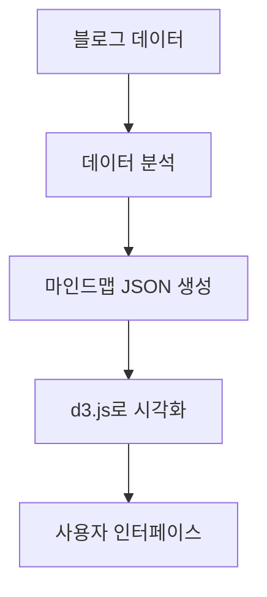

# Jekyll 블로그의 사용자 정의 기능

이 포스트에서는 Jekyll 블로그에 추가한 다양한 사용자 정의 기능들에 대해 자세히 설명합니다.

## 역링크 기능

[Jekyll 블로그 시작하기]() 포스트에서 소개했듯이, 우리 블로그는 자동 역링크 기능을 지원합니다. 이 기능은 포스트 간 연결을 시각화하고 관련 컨텐츠를 쉽게 탐색할 수 있게 합니다.

위키링크 형식인 `[[포스트 제목]]`을 사용하여 다른 포스트를 참조할 수도 있습니다. 예를 들어, [[Jekyll 블로그 시작하기]] 포스트로 쉽게 이동할 수 있습니다.

## 태그 시스템

태그 기능을 사용하면 관련 주제의 포스트를 쉽게 찾을 수 있습니다. 이 포스트는 `jekyll`, `blog`, `customization`, `features` 태그가 붙어 있습니다.

## 마인드맵 기능

마인드맵 기능은 다음과 같은 방식으로 구현되었습니다:



## 코드 블록과 프롬프트 블록

### 코드 블록 예제

```javascript
// TypeScript로 구현된 코드 블록 기능
class CodeBlocksManager {
  constructor() {
    document.addEventListener('DOMContentLoaded', () => {
      this.initCodeBlocks();
    });
  }
  
  private initCodeBlocks(): void {
    // 코드 블록 초기화 로직
    console.log("Code blocks initialized");
  }
}
```

### 프롬프트 블록 예제

```prompt:user
사용자 질문
Jekyll 블로그에서 커스텀 기능을 어떻게 추가하나요?
```

```prompt:assistant
도우미 응답
Jekyll 블로그에 커스텀 기능을 추가하는 방법은 다양합니다. 플러그인을 사용하거나, 자바스크립트로 직접 구현하거나, 또는 Liquid 템플릿을 확장할 수 있습니다.
```

## 다음 단계

지금까지 구현한 기능들을 더 개선하고 새로운 기능을 추가할 계획입니다. 제안이나 의견이 있으시면 GitHub 이슈를 통해 알려주세요! 