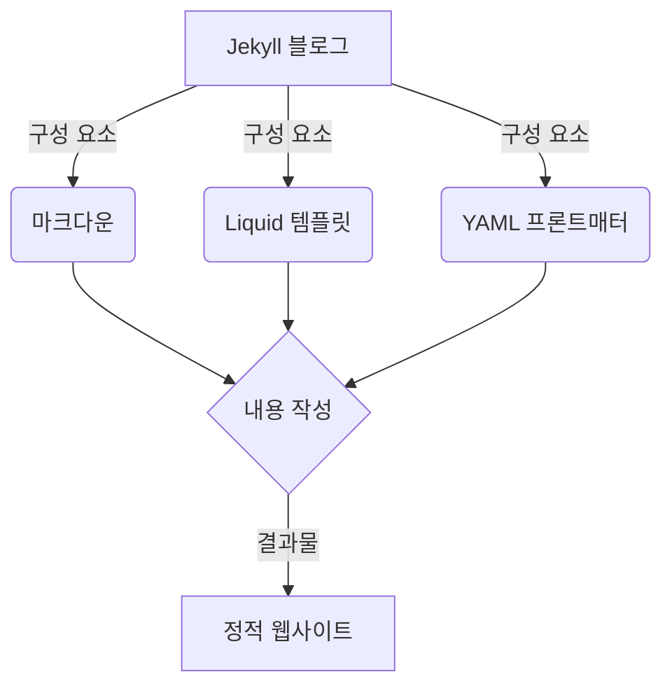

# Jekyll 블로그에 오신 것을 환영합니다!

이 글은 Jekyll 블로그의 첫 번째 포스트입니다. 이 블로그는 다음과 같은 특별한 기능들을 가지고 있습니다:

1. **자동 역링크 생성** - 다른 포스트에서 이 포스트를 링크하면 자동으로 역링크가 생성됩니다.
2. **문서 내 태그 생성** - 포스트에 태그를 추가하고 태그 클라우드에서 확인할 수 있습니다.
3. **포스트 기반 마인드맵** - 포스트와 태그 간의 관계를 시각적으로 확인할 수 있습니다.
4. **코드 블록 표시 기능** - 구문 강조와 복사 버튼을 지원합니다.
5. **프롬프트 블록 표시 기능** - 다양한 유형의 알림 블록을 생성할 수 있습니다.
6. **머메이드 차트 표시 기능** - 다이어그램을 생성하고 표시할 수 있습니다.

## 코드 블록 예제

```python
def hello_world():
    print("Hello, Jekyll!")
    return True

# 함수 호출
hello_world()
```

## 프롬프트 블록 예제

```prompt:info
정보 안내
이것은 정보 프롬프트 블록입니다.
```

```prompt:warning
주의 사항
이것은 경고 프롬프트 블록입니다.
```

```prompt:error
오류 발생
이것은 오류 프롬프트 블록입니다.
```

## 머메이드 차트 예제



## 다른 포스트 링크 예제

다음 포스트 [[Jekyll 사용자 정의 기능]]을 참조하세요.

## 마무리

Jekyll과 함께 멋진 블로그 여정을 시작해보세요! 